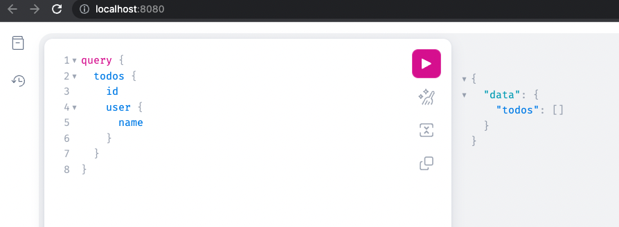
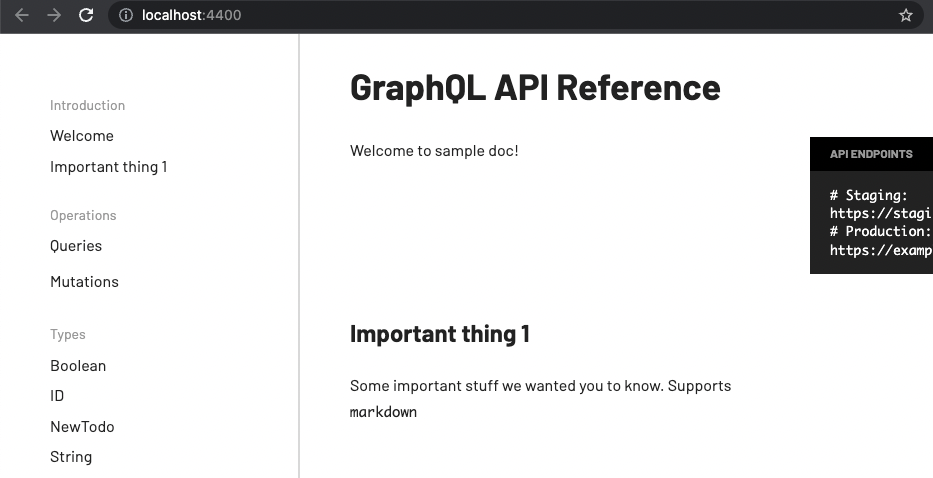

# go-config-server

[](https://github.com/go-zen-chu/go-graphql-server/actions)
[](https://github.com/go-zen-chu/go-graphql-server/issues)

golang config server example using graphQL.

## Develop GraphQL server

1. update files in ./graph
1. run command below to generate

    ```bash
    make gen-gql-resolver
    ```

1. check it works as expected (using `open` command for Mac)

    ```bash
    make run-gql-playground
    ```

    

## Generate API Docs

```bash
make run-gql-doc
```


